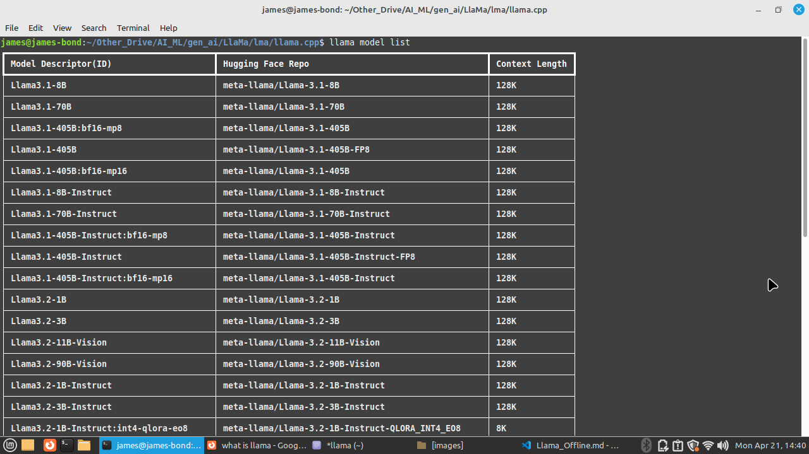

# Run llama offline in your PC
    llama is a (meta/facebook) gpt model equivalent to chat gpt 3
    An open-source large language models (LLMs) developed by Meta AI
---
#### What we are going to have with this ?
    **Overview**
    Once you complete the process, you will be able to run lama model offline in your local PC. 
    If you get success running all the steps mentioned here, you will be able to use a chatgpt kind 
    of prompting system that runs in your local PC/Laptop.
    
    There are several **llama** models vailable in internet to download freely where some needs 2 GPU with 80GB RAM
    and some similar hardware but there is also low end models that llama were published with that can run on 
    local PC having no GPU with only 4GB of RAM.

### Prerequistes:
    # a Linux PC/Laptop
    # decent RAM - minimum 4GB (as reported worked)
    # a decent CPU (rasberiPi with 4GB works)

    # basic c++ knowldge (not mandatory)
    # linux machine very basic skill to run commands and install several packages using sudo apt-get and pip

---

## Lets Start
This spec is influenced by a youtube link and all credit goes there. Therefire I would request you to first see the video to get some idea what is happening here. Link : 

Steps to folow sequentilly:
 - 1: Watch the youtube video to get the idea
 - 2: git clone the repo
 - 3: compile the project in Linux using make or cmake
 - 4: download the llama model that you want to run locally
 - 5: place the downloaded model in your cloned folder
 - 6: run few commands to make it running

----
Some References:
- llama model download path: 
        - https://www.llama.com/llama-downloads/

- additional file:
        - source code to clone :        
        - other files: https://github.com/cornelk/llama-go/blob/go/convert-pth-to-ggml.py

-----

Running Steps 1 by 1:

Step 1: Watch the video @
    https://www.youtube.com/watch?v=EgoHtsOgZhY&t=71

Step 2: clone the llama.cpp project using the following command
        Source: https://github.com/ggml-org/llama.cpp
   
     md llama
     cd llama
     git clone https://github.com/ggml-org/llama.cpp
     ls

    now cd into the folder after complete cloning: (do not download from git, do clone only)

    james@james-bond:~/Other_Drive/AI_ML/gen_ai/LlaMa/lma/llama.cpp$

Step 3: Compile the project

    the video tutorial says use 'make' - make is a linux command that builds your project and in this case it is .cpp files. 
    But you might facse challeges here and may be you run then 'cmake'.
    This part for any complecation we will discuss later but lets assume you are able to buld the project using make or cmake linux command

    - you mught need installing lots of linux packages as it will suggest if any compile error in the make or cmake command. So just follow the shell 

    [For many - it can be the hardest part to buidl the llama.cpp folder as it needs some C++ knowldge as how a c++ project compiles]. 
    For me this steps became the hardest Step among all mentioned steps. 
        So best of luck!

    **"You are building a cpp (c++) project folder"** in linux with source code opened.

    - If you are stuck for hrs with bad luck - move to step:4 (we still can do that later).     
      Consult me for any build issue in Linux.

Step 4: download the llama model from lama website (legal)

    https://www.llama.com/llama-downloads/
    
    [after vitiing the site, do the registration process as instructed]
    Fill the form and select your model to download.

    There are no of models and that are on top - they use heavy GPU that we do not have, so scroll down and find the "Previous language & safety models" to find       the low end model that is "Llama 2" . This Llama-2 model we should be able to run locally in our local PC without any GPU.

    
      

    Follow the instruction given in the web site to complete the download.

    Note: This is 13GB model and once done, it will be saved in your local PC '/home/' directory. For me it is '', also can be found in shell as you are downloading

 Step 5: Place the llama.model to project folder
    save/transfer the model to your desired folder in this case:
        
        A) go to your cloned folder
        B) paste in your model folder
    
    By now you are all set to start processing.

        Some commands to check what all **llama** model actually exists in public
        run the command in shell
            '''shell
            llama model show
            '''
            

 Step 6: run the model
    A) download the file and place in project root folder
        - https://github.com/cornelk/llama-go/blob/go/convert-pth-to-ggml.py
        [As seems this file is missing in initial cloned project of llama.cpp]
        - you can ignore the step, if the file 'convert-pth-to-ggml.py' already exists

    B) run the commands
        
        #install the required libs
            sudo python3 -m pip install torch numpy sentencepiece

        #convert 7B model to ggml FP16 format (that reduces the 13GB model to 3GB)
            python3 convert-pth-to-ggml.py models/Llama-2-7b 1

            [The parameter is 0 or 1] *** be mindfull of the folder name being used/downloaded

        **This is the area of heavy load and you will possibly be crashed due to low PC hardware**. I am running a on a Laptop 'Acer Celeron Processor with 2GB RAM' to crash as 

        # quantize the model to 4-Bits
            python3 quantize.py 7b
    

        Here you are just 2% behind the run.

        For rest of the steps:
        Please follow the youtube link https://www.youtube.com/watch?v=EgoHtsOgZhY&t=71
          as am at this stage spinning up a new linux system/PC to re-attempt (after my old PC not adequate to handle it).
        
        Best Of Luck !
----

## Some usefull ref:

https://github.com/meta-llama/llama-models/blob/main/README.md

llama.ccp project (main): 
https://github.com/ggml-org/llama.cpp

https://github.com/ggml-org/llama.cpp/blob/master/README.md

https://github.com/meta-llama/llama-models/tree/main

    

