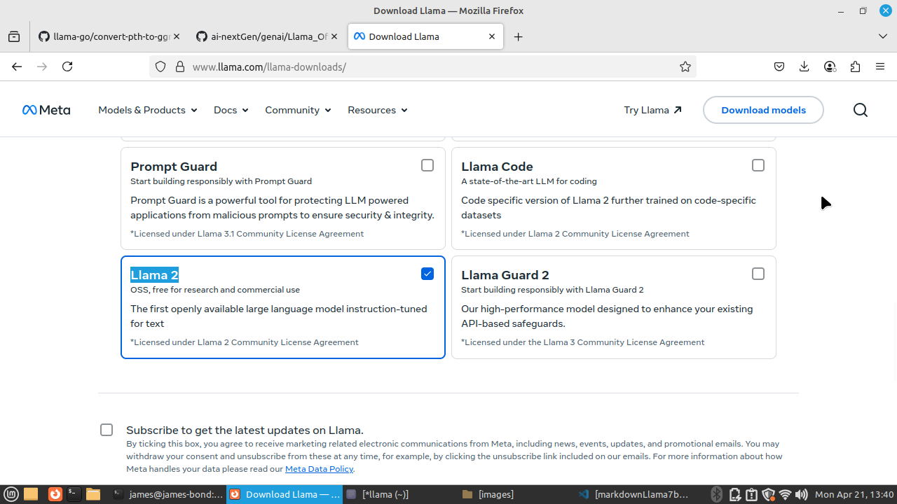

## Run LLaMA Offline on Your PC

**LLaMA** 
is a GPT-equivalent model (developed by Meta/Facebook), part of the open-source large language models (LLMs) by Meta AI.

LlaMa Use Cases

* Chatbots and conversational AI
* Content generation and writing assistance
* Language translation and understanding
---

## 🤔 What Will You Get From This?

**Overview:**  
Once you complete the setup, you’ll be able to run the LLaMA model offline on your local PC. You'll effectively have a ChatGPT-style prompting system running locally.

There are various **LLaMA** models available online. Some require high-end hardware (like dual GPUs with 80GB RAM) like 'Llama Scout' but there are also lighter models that can run on machines with no GPU and only 4GB RAM.
like 'Llama 2' / 7b.
we will target this Llama 2 model, however if you have highend pc, you can try any model with same instructions given here.

---

## 🧰 Prerequisites

- A Linux PC/Laptop  
- Minimum 4GB RAM (Reported to work)  
- A decent CPU (Even Raspberry Pi with 4GB has been reported to work)  
- Basic C++ knowledge (Optional)  
- Basic Linux skills (Installing packages, running commands)

---

## 🚀 Let's Start

> ⚠️ This setup is influenced by a YouTube tutorial. Please watch the video first to get a sense of the overall process:  
> [YouTube Link](https://www.youtube.com/watch?v=EgoHtsOgZhY&t=71)

### Step-by-Step Instructions:

1. **Watch the YouTube video.**
2. **Clone the repository.**
3. **Compile the project using `make` or `cmake`.**
4. **Download the LLaMA model.**
5. **Place the model in your cloned folder.**
6. **Run commands to get it working.**

---

## 📚 References

- **LLaMA model downloads:**  
  [https://www.llama.com/llama-downloads/](https://www.llama.com/llama-downloads/)

- **Source code repo to clone:**  
  [https://github.com/ggml-org/llama.cpp](https://github.com/ggml-org/llama.cpp)

- **Additional scripts:**  
  [convert-pth-to-ggml.py](https://github.com/cornelk/llama-go/blob/go/convert-pth-to-ggml.py)

---

## 🧑‍💻 Running Steps in Detail

### Step 1: Watch the Video

Watch this YouTube video to get started:  
[https://www.youtube.com/watch?v=EgoHtsOgZhY&t=71](https://www.youtube.com/watch?v=EgoHtsOgZhY&t=71)

---
Start making your hand dirty ..
### Step 2: Clone the Repository

```bash
mkdir llama
cd llama
git clone https://github.com/ggml-org/llama.cpp
cd llama.cpp
```

Make sure you use `git clone` (not downloading the ZIP).

---

the everest camp 3
### Step 3: Compile the Project
command depends on linux flavour
Use:

```bash
make
```

If `make` fails, try: (am on linux mint)

```bash
cmake .
```

> ⚠️ You might face errors during compilation due to missing packages. Install the suggested dependencies using `sudo apt-get` or `pip`.  
> This step can be the hardest due to C++ build issues. Don't worry—just ask for help if you get stuck!

---

### Step 4: Download the LLaMA Model

- Visit: [https://www.llama.com/llama-downloads/](https://www.llama.com/llama-downloads/)
- i was downloading a top end model that needs 600gb and runs on 80gb Nvidia cuda gpu. so feel free to make yourself donky untill you realize the case.
- Register, fill out the form, and download a model that your pc can support
- Scroll to **"Previous Language & Safety Models"** to get the low-end "LLaMA 2" model that runs on basic hardware.
- The model is ~13GB in size and is usually saved in your `/home/` directory.

> 

---

### Step 5: Move Model to Project Folder

1. Go to your cloned project directory.
2. Paste the downloaded model into the `models/` folder.

To check available public models:

```bash
llama model show
```
```bash
# Download the model [llama 7 b]
llama model download --source meta --model-id  Llama-2-7b
```

> 

---

### Step 6: Run the Model

1. Download and place the required script in your project root:

   [convert-pth-to-ggml.py](https://github.com/cornelk/llama-go/blob/go/convert-pth-to-ggml.py)

2. Install dependencies:

```bash
sudo python3 -m pip install torch numpy sentencepiece
```

3. Convert the 7B model to GGML FP16 format:

```bash
python3 convert-pth-to-ggml.py models/Llama-2-7b 1
```

- Use `0` or `1` as the second argument based on the model.
- Ensure correct folder names.

> ⚠️ This step may crash on low-end hardware. If using a machine with 2GB RAM (e.g., Acer Celeron), it may not complete.
image just before it crashes in full 2 gb ram
> 

4. Quantize the model to 4-bit:

```bash
python3 quantize.py 7b
```
You’re 98% done! For the final steps, refer to the video tutorial again.
[https://www.youtube.com/watch?v=EgoHtsOgZhY&t=71](https://www.youtube.com/watch?v=EgoHtsOgZhY&t=71)

**Conclusion:**
Since I have been crashed with my 2GB RAM in a celeron Laptop to run the model, spinning up a new system with Limux that has higher RAM. 
Untill then Best Of Luck!

**World is not enough!**
Here I go again with a new PC with Ryzen7 Series + 34 GB of RAM + 20 GB Linux Swap Mem
And I make progress. Its observed that - all these requires some 70GB local DISK space additional to OS cosumed area.
So a 150 GB Linux OS disk will be fine for this or build all your output to an external source.


```bash
# install Python dependencies
python3 -m pip install -r requirements.txt

# convert the model to ggml FP16 format
python3 convert_hf_to_gguf.py ./models/Llama-2-7b/

# quantize the model to 4-bits (using Q4_K_M method)
./bin/llama-quantize ./models/Llama-2-7b/out/Llama-2-7B-F16.gguf ./models/Llama-2-7b/out/ggml-model-Q4_K_M.gguf Q4_K_M

```
By now you ge2 files: (under your model folder)

    Llama-2-7B-F16.gguf
    ggml-model-Q4_K_M.gguf
    
```bash
# Run the quantized model:
# start inference on a gguf model

./bin/llama-cli -m ./models/Llama-2-7b/out/ggml-model-Q4_K_M.gguf -cnv -p "You are a helpful assistant"
```
========
I ended up with an error saying :

"llama_model_load: error loading model: missing tensor 'token_embd.weight'" - so will keep investigatijg from here again....


---

## ✅ Additional Resources

- [Meta's LLaMA GitHub](https://github.com/meta-llama/llama-models/blob/main/README.md)
- [LLaMA.cpp main repo](https://github.com/ggml-org/llama.cpp)
- [LLaMA.cpp README](https://github.com/ggml-org/llama.cpp/blob/master/README.md)

- [ChatGpt style LLM on Web](https://www.meta.ai)
- 
